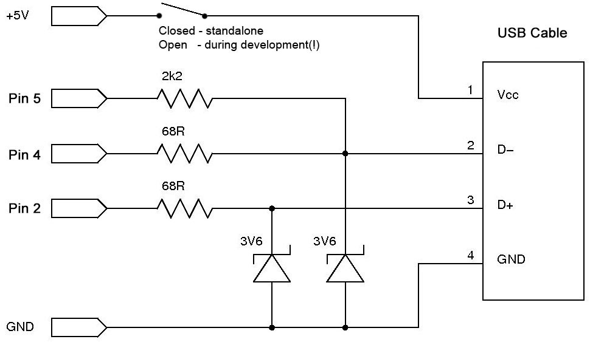

# unoHID

Use Arduino UNO as USB Keyboard and Mouse.<br />

Aims to be compatible with official Arduino [Mouse](https://www.arduino.cc/reference/en/language/functions/usb/mouse/) and [Keyboard](https://www.arduino.cc/reference/en/language/functions/usb/keyboard/) libraries.<br />
A user-friendly implementation of [Obdev's V-USB driver](https://www.obdev.at/vusb/), for Arduino UNO R3 and other boards based on ATmega328.


**[API](/docs/API.md)** <br />

[What is V-USB?](#what-is-v-usb) <br />
[Wiring](#wiring) <br />
[DevKit Sketch](#devkit-sketch) <br />
[Advanced Config](#advanced-configuration) <br />
[Installation](#installation)


## What is V-USB?

>V-USB is a software-only implementation of a low-speed USB device for Atmel’s AVR® microcontrollers,
>making it possible to build USB hardware with almost any AVR® microcontroller,
>not requiring any additional chip.

Some Arduino boards have native USB support; not the Uno. This library adds USB support, using the V-USB driver.

Your Arduino will *not* appear as a USB keyboard or mouse through the built in USB port. Instead, you will need to wire a secondary USB port, using pins 2,4 and 5.


## Wiring



Pins 2, 4, and 5 are reserved for the library. You will get away with some variation, but remember that the D+ / D- lines will be **very** unhappy if they start to see much more than 3.3V.

**Note: 5V should not be connected to target device when using the DevKit sketch**. [Find out more](./self-powered/warning.md)

## Using the library

```cpp
#include <unoHID.h>

void setup() {
    // Start USB connection
    Mouse.begin();
    Keyboard.begin();

    // Type some text
    Keyboard.print("Hello, World!");

    // Click the mouse
    Mouse.click();

    // End USB connection
    Mouse.end();
    Keyboard.end();
}

void loop() {}
```

You must call `Mouse.begin()` or `Keyboard.begin()` after you have already connected the USB port to the target device.

For a complete list of commands, [consult the API](./API.md). This library aims to be compatible with code written for the official Arduino [Mouse](https://www.arduino.cc/reference/en/language/functions/usb/mouse/) and [Keyboard](https://www.arduino.cc/reference/en/language/functions/usb/keyboard/) libraries.

## DevKit Sketch

To speed up devlopment, this library comes bundled with a "DevKit" sketch. You can find this with the rest of the examples.

Upload the sketch to your Arduino and open a serial monitor (9600 baud) to access a command line for executing unoHID commands.

**Note: 5V should not be connected to target device when using the DevKit sketch**.<br />
[Find out more](./self-powered/warning.md)

## Advanced Configuration

### Timers

Some hardware requires periodic contact with the USB device (Arduino) to remain connected. By default, the library handles this automatically, by "polling" every 10ms with Timer 2. 

This solution may be user-friendly, but it is not particularly elegent. 

If needed, this automatic polling beviour can be changed:

```cpp
// Must come before #include
#define POLL_WITH_TIMER1

#include <unoHID.h>
```
or
```cpp
// Must come before #include
#define POLL_MANUALLY

#include <unoHID.h>

void loop() {

    // Manual polling
    VUSB.poll();
}
```

Expect a note in your build output if this option has been successfully modified.

### USB Device Name

It is possible to change the name reported by the USB device.
[Obdev](https://www.obdev.at/products/vusb/index.html), the authors of V-USB, have some requests, which you can read in [USB-IDs-for-free.txt](https://github.com/todd-herbert/unoHID/blob/main/doc/vusb/USB-IDs-for-free.txt).

To change the device name, edit the file [./src/vusb/usb_descriptor.h](/src/vusb/usb_descriptor.h), in your [Arduino IDE libraries folder](https://docs.arduino.cc/hacking/software/Libraries).

```cpp
#define USB_CFG_DEVICE_NAME_LEN     6
#define USB_CFG_DEVICE_NAME         'U', 'n', 'o', 'H', 'I', 'D'
```

* Names should be no longer than 18 characters
* Length must be be updated to match new name
* Name should be given as a set of chars, seperated with commas (as shown above)


### Rate-limiting

In the official examples from Arduino, pauses are manually added between updates.

If you would prefer, you can instead use `Mouse.setTxDelay(duration)` and `Keyboard.setTxDelay(duration)`. All subsequent commands will be followed with a delay of `duration` (in milliseconds).

Default is 0ms for Mouse, and 20ms for Keyboard.


## Installation

**Arduino:** Library can be installed to Arduino IDE with *Sketch* -> *Include Library* -> *Add .Zip Library..*, or through the built-in Library Manager.

**Platform.io:** Available through the built-in library registry, or alternatively, can be installed by extracting the Zip file to the lib folder of your project.